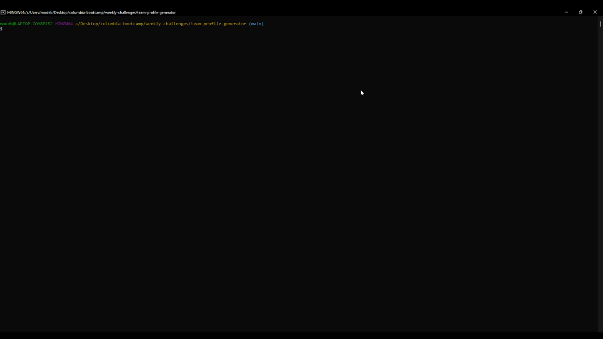
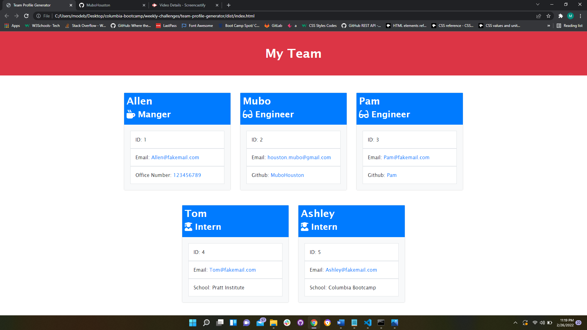

<h1 align="center"> Welcome to Team Profile Generator</h1>

## Description 

This is a Node.js command-line application that takes in information about employees on a software engineering team and generates an HTML webpage that displays summaries for each person. This app was built using JEST for running unit tests and Inquirer for collecting input from the user.

## Demo
Video of passing tests using JEST:

<a href="./assets/generated-TPG-page.gif">Link to passing test</a>



Video of the typical user flow:

<a href="https://drive.google.com/file/d/1RWBfQLLwJhmtZpU4Six8N4Znx8ohMnc8/view">Link to walk-through video</a>


(For better quality, download video from the link above)

Video of generated page:

<a href="https://drive.google.com/file/d/1LpRz9MoqRd6l77Bs68Xskn2SkL1GkNDC/view">Link to generated HTML page</a>


Screenshot of generated webpage:



## Installation 

1. Clone the repository

```bash
git clone https://github.com/MuboHouston/team-profile-generator.git
```

2. Change the working directory

```bash
cd team-profile-generator
```

3. Install dependencies

```bash
npm install
```

4. Run the app

``` bash 
npm start
```


## Contribution

Contributions, issues, and feature requests are welcome!

## Author

Mubo Houston

- GitHub: [@MuboHouston](https://github.com/MuboHouston)